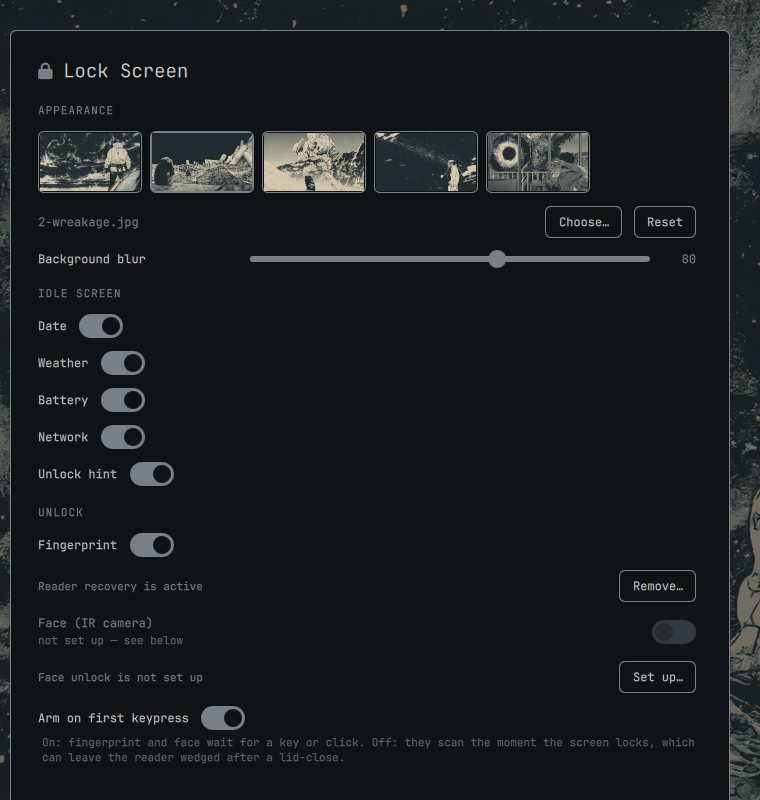

# Lock Screen+

A replacement lock screen for [Omarchy](https://omarchy.org/): an idle face with
a clock, weather and system status, unlock methods that arm on your first
keypress, and a settings panel to configure it.



## Why

Omarchy's stock lock screen starts a fingerprint scan the instant the session
locks. On a lid close that scan begins about a second before the machine
suspends, and suspend kills it mid-flight. On a single-client match-on-chip
reader the device is left claimed, so every attempt after resume fails, and the
lock screen retries at a fixed 250ms with no backoff — around three attempts a
second, keeping the reader pinned so it can never recover.

This plugin waits for you to press a key before scanning anything. Nothing is
in flight when suspend hits, so nothing gets wedged.

## What you get

**Idle face** — a large clock with date, weather, battery and network, on a
sharp background. Press any key (or click) and it hands over to the password
field; Escape brings it back. By default it appears on the built-in laptop
panel (the focused screen when the lid is shut); the settings panel can put it
on the focused screen or on every screen instead.

**Unlock** — fingerprint and face both start on that first keypress, whichever
answers first. Face unlock is optional and needs a one-time setup; see below.

**Settings panel** — from the companion plugin
[omarchy-lock-plus-settings](https://github.com/diegodiaz1256/omarchy-lock-plus-settings):
background (theme thumbnails or any image), blur, which elements the idle face
shows, and which unlock methods are enabled. Fully keyboard navigable.

## Install

The settings panel ships separately, because `omarchy plugin add` installs one
plugin per repository. Install both:

```bash
omarchy plugin add https://github.com/diegodiaz1256/omarchy-lock-plus
omarchy plugin add https://github.com/diegodiaz1256/omarchy-lock-plus-settings
omarchy plugin disable omarchy.lock
omarchy restart shell
```

They are two plugins because Omarchy's host mounts on-demand panels through a
loader and calls their `open()` when summoned, but a plugin marked `keepLoaded`
never gets a loader entry. The lock service must be `keepLoaded` — it has to
stay resident to lock the session — so a panel inside the same plugin would
never open.

The lock screen works on its own; without the settings plugin you edit
`~/.config/omarchy/lockface.json` by hand.

To go back to the stock lock screen at any time:

```bash
omarchy plugin disable zeroge.lock
omarchy plugin enable omarchy.lock
omarchy restart shell
```

Add a menu entry by putting this in `~/.config/omarchy/extensions/omarchy-menu.jsonc`:

```jsonc
"lockscreen": {
  "icon": "󰌾",
  "label": "Lock Screen",
  "aliases": ["lock"],
  "description": "Idle face, background, and unlock methods",
  "action": "omarchy-shell shell summon zeroge.lock-settings"
}
```

## Optional extras

Both are off by default and installed from the settings panel (or by running
the scripts in `bin/` directly), because both add a root service. Each explains
what it does and what it costs before asking.

### Face unlock

Needs an IR camera and [howdy](https://github.com/boltgolt/howdy) with a face
enrolled. Howdy keeps its models root-only — correct, they are biometric data —
but the lock screen runs as your user and cannot read them, so face auth
silently does nothing.

The setup installs a small socket-activated service that answers one question:
does the person at the camera match the user who asked? Your session never
gains privilege; it connects to a socket and reads one byte back. Identity comes
from the kernel (`SO_PEERCRED`), so a caller cannot ask about another user, and
the service is sandboxed the way `fprintd` is — no home access, no network, no
new privileges, IR camera only.

It does not make howdy's matcher safe, only contained. Fingerprint is the
stronger factor; if you have a working reader you probably do not need this.

Face unlock depends on ambient infrared, so a dark room can fail with every
frame below howdy's `dark_threshold`. When that happens the lock screen says
"Camera sees nothing — is it covered?" rather than failing silently: a closed
privacy shutter and an unlit room are indistinguishable from software, so it
offers the shutter as a possibility rather than a diagnosis.

### Fingerprint reader recovery

A workaround for a driver bug, not a feature. `libfprint-egismoc` asserts and
aborts `fprintd` when the reader is opened while another operation is running:

```
egismoc.c:1907: egismoc_open: assertion failed: (self->task_ssm == NULL)
```

sudo, polkit and the lock screen all use the reader, so the collision is easy to
hit. The abort leaves a corrupted SDCP pairing claim on disk, and from then on
every verify fails until the claim is deleted by hand — breaking fingerprint
everywhere at once, surviving reboots, with no visible cause.

The watchdog watches the journal for that failure and clears the stale claim so
the driver re-pairs. Upstream issue:
[libfprint-egismoc-sdcp#13](https://github.com/TenSeventy7/libfprint-egismoc-sdcp/issues/13).

If your reader is reliable, skip it.

## Settings

Stored in `~/.config/omarchy/lockface.json`, written by the panel:

| Key | Meaning |
|---|---|
| `background` | Lock background; empty follows the session wallpaper |
| `blur` | 0–128, applied once the password field appears |
| `showDate` `showWeather` `showBattery` `showNetwork` `showHint` | Idle face elements |
| `fingerprintEnabled` `faceEnabled` | Unlock methods |
| `armOnInput` | Wait for a keypress before scanning (recommended) |
| `lockDisplay` | `internal` (laptop panel), `focused`, or `all` |

`armOnInput` is the setting that avoids the suspend problem above. Turning it
off restores the stock behaviour of scanning the moment the screen locks.

## Requirements

Omarchy 4.x with the Quickshell-based shell. Weather uses `curl` and `jq`
against wttr.in; the background picker uses `zenity`. Fingerprint and face are
each optional and detected at runtime — the panel greys out what is unavailable
and says why.

## Licence

MIT.
